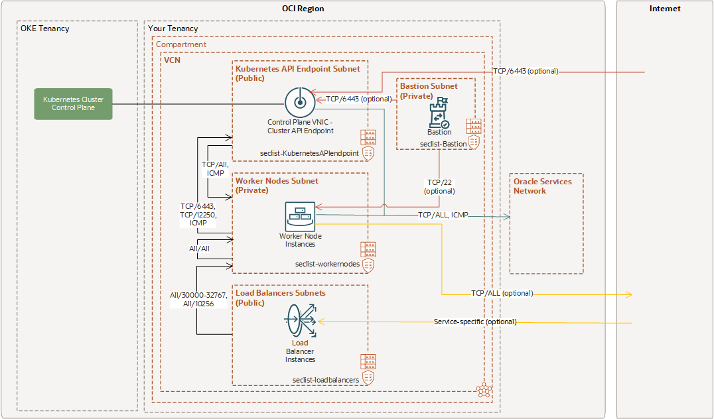

# HIGH-LEVEL ARCHITECTURE 

# Steps
Read through these to understand Oracle Cloud components

[TOPOLOGY](https://github.com/oracle-terraform-modules/terraform-oci-oke/blob/main/docs/topology.adoc)

[INSTRUCTIONS](https://github.com/oracle-terraform-modules/terraform-oci-oke/blob/main/docs/instructions.adoc)

<ol>
    <li>Install Terraform CLI</li>
    <li>Clone https://github.com/oracle-terraform-modules/terraform-oci-oke</li> 
    <li>Copy "terraform.tfvars" into the cloned repo</li>
    <li>Replace placeholders with your credentials</li>
    <li>Run terraform init - terraform plan - terraform apply</li> 
</ol>
